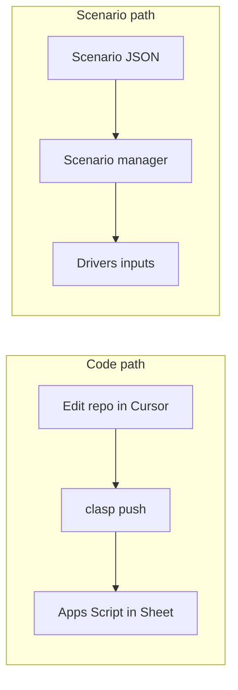

# Deskree forecast — Google Sheets

Google Apps Script project used to **build and run financial forecasting for Deskree** inside Google Sheets. The spreadsheet model covers drivers, funding, headcount, revenue, P&L, cash flow, scenarios, and a **benchmark reality check**; a custom sidebar loads packaged scenarios into the input sheet.

## What’s in this repo

| File | Role |
|------|------|
| `SetupMain.gs` | `setupFinancialModel()` — orchestrates setup; logs each phase to **Logger** (Executions / View → Logs). Set `SETUP_PROGRESS_TOAST = true` for sheet toasts. |
| `ModelConstants.gs` | Shared maps: `DR`, `REVCOLS`, `PNL`, `CF`, `SUM`, etc. (used by setup + `benchmarks.gs`). |
| `SetupHelpers.gs` | Shared layout helpers (`hdr`, `colLetter`, …). |
| `SetupInstructions.gs`, `SetupInvestorBrief.gs`, `SetupDrivers.gs`, `SetupFunding.gs`, `SetupHeadcount.gs`, `SetupRevenue.gs`, `SetupPnL.gs`, `SetupCashFlow.gs`, `SetupSummary.gs`, `SetupBenchmarksTab.gs` | One tab (or tab pair) each; all called from `SetupMain.gs`. |
| `ScenarioSidebar.gs` | Custom menu, `applyScenario` / `getCurrentScenario` (**v3.1** Drivers layout, `DR`), and opens the HTML sidebar. |
| `ScenarioSidebarView.html` | Sidebar UI (hosted as an HTML file in the Apps Script project). |
| `InvestorView.gs` | `showInvestorView` / `showInternalSheets` — investor mode hides internal tabs + **Start here**; opens **`📋 For investors`** (built in `SetupInvestorBrief.gs`). |
| `Benchmarks.gs` | `runBenchmarks()` — reads **Drivers**, **Headcount**, **P&L**, and **Cash flow**, scores key SaaS metrics, and writes results to **🚦 Benchmarks**. |

## Getting started with Cursor

Use [Cursor](https://cursor.com/) (or any editor) on **this git repo** when you are changing **source code**. The distinction below matters: one path changes **how the model works**; the other only changes **inputs** into the existing model.

### Two tracks (code vs scenarios)

| | **A — Apps Script / repo (code)** | **B — Scenarios (data only)** |
|---|-------------------------------------|--------------------------------|
| **Goal** | Change behavior: formulas, new drivers, benchmarks, sidebar, setup tabs, `DR` row maps, revenue/headcount logic | Try different **assumptions** using the **same** model: funding, ACVs, segments, horizon, etc. |
| **What you edit** | Files in this repo: `*.gs`, `ScenarioSidebarView.html` | JSON that matches the v3.1 scenario shape (see [`scenarios/scenario-template.json`](scenarios/scenario-template.json) or [`scenarios/7m-round.json`](scenarios/7m-round.json)) |
| **How it gets into Sheets** | **`clasp push`** uploads code to the bound Apps Script project; reload the spreadsheet | **No deploy:** open the spreadsheet → **📊 Forecast → Open Scenario Manager** (menu label is `APP_MENU_LABEL` in `ModelConstants.gs`) → **Load from sheet** or paste JSON → **Load into Sheet**. Optionally copy JSON from this repo or from an AI chat. |
| **Uses AI how?** | Cursor / Copilot / chat **on the codebase**: refactor `Benchmarks.gs`, add a metric, fix `SetupDrivers.gs`, explain `ModelConstants.gs` | ChatGPT / Claude / etc. **draft or tweak scenario JSON** from a plain-English brief; you paste into the sidebar. You can also **Export** current Drivers JSON from the scenario manager, edit in the AI, and paste back. |
| **Requires clasp?** | **Yes**, to sync local edits to Apps Script (unless you paste into the browser editor by hand) | **No** for trying scenarios in a Sheet someone already shared. **Yes** only if you also want to version JSON in git or change code. |

**Rule of thumb:** If you need to **adjust or change the behavior of the forecast** (new calculations, different sheet layout, benchmark rules, scenario JSON fields), you work **in this repo** and **push Apps Script** with clasp. If you **do not** need functionality changes—only different numbers and assumptions—you can **iterate with AI-generated scenarios**, load them in Google Sheets, run **Check Benchmarks**, and repeat **without** touching `.gs` files or running `clasp push`.



### Environment setup (local)

1. **Clone** this repository and open the folder **as the project root** in Cursor.
2. Install **[Node.js](https://nodejs.org/)** (LTS is fine). Clasp runs on Node; you also use `npm` if you add tooling later.
3. Install **clasp** globally: `npm install -g @google/clasp` (same as in [Deploy with clasp](#deploy-with-clasp-local--google-sheets) below).
4. **Authenticate once:** `clasp login` (browser OAuth for the Google account that owns the spreadsheet).
5. **Bind to the right script:** ensure [`.clasp.json`](.clasp.json) `scriptId` matches **your** Apps Script project (**Project Settings → Script ID**). If you fork or duplicate the Sheet, update `scriptId` or you will overwrite the wrong project.

After that, day-to-day upload is: edit files in Cursor → `clasp push` from the repo root → **reload** the Google Sheet so menus and scripts refresh.

### clasp in one minute (details below)

From the repo root:

```bash
clasp push
```

For login, pull, `open-script`, API enablement, and forks, see **[Deploy with clasp (local → Google Sheets)](#deploy-with-clasp-local--google-sheets)**—that section is the full reference; this Cursor section only frames *when* to use it versus scenarios.

### Suggested workflows

- **Scenario-only iteration (no code):** Describe the case to an AI → get JSON → **📊 Forecast** menu **{ } JSON** → Load → **🚦 Check Benchmarks** → adjust JSON and repeat. Commit updated JSON under [`scenarios/`](scenarios/) if you want history.
- **Code change:** Branch in git → edit `*.gs` / HTML in Cursor → `clasp push` → test in Sheets → PR. Use **Rebuild model** from the custom menu only when you changed **setup** or tab structure (destructive; see Development notes).

## Model overview

Running `setupFinancialModel()` builds these sheets:

- **Start here** (`SHEET_INSTRUCTIONS` in `ModelConstants.gs`) — how to use the model (inputs vs formulas) and workflow (including when to run benchmarks).
- **For investors** — short external-facing guide: how to read Summary / Revenue / P&L / Cash flow, high-level note that the forecast is produced with Deskree’s internal planning model and checked against benchmarks and industry ranges. Shown when entering **investor view**; the **Start here** tab is hidden in that mode.
- **Drivers** — the **only** tab where you enter assumptions: funding rounds, ARR targets, ICP segments (mid-market & enterprise), logo ramp, maintenance ratios (AE / FDE / CSM), department defaults, individual roles, marketing, infrastructure, and sales comp.
- **Funding**, **Headcount**, **Revenue**, **P&L**, **Cash flow**, **Summary** — calculated views driven from Drivers.
- **Scenarios** — scenario comparison / framing.
- **Benchmarks** — populated when you run **Check Benchmarks** (not auto-updated on every edit).

The model follows **inputs → calculations → outputs**: keep assumptions in **Drivers** so downstream formulas stay intact.

## Custom menu (spreadsheet toolbar)

From `ScenarioSidebar.gs` → `onOpen()`, the **📊 Forecast** menu (rename via `APP_MENU_LABEL` in `ModelConstants.gs`) provides:

1. **Open Scenario Manager** — HTML sidebar to apply a scenario or inspect **current model state** (`getCurrentScenario()`).
2. **Check Benchmarks** — runs `runBenchmarks()` and fills **🚦 Benchmarks** with traffic-light style checks (e.g. CAC payback, LTV:CAC, implied NRR vs churn/expansion, growth vs Bessemer-style heuristics, ARR vs capital raised, AE account load, gross margin, burn multiple when wired).
3. **Rebuild model (run setup)…** — confirms, then runs `setupFinancialModel()` (same as in **Extensions → Apps Script**). Clears and rebuilds model tabs; duplicate the file or export data first if you need to keep current values.
4. **Enter investor view (hide internal tabs)** — hides **Drivers**, **Headcount**, **Funding**, **Benchmarks**, and **Start here**; opens **`📋 For investors`** (external how-to copy in `SetupInvestorBrief.gs`).
5. **Show all internal sheets** — unhides those tabs and **Start here**, and activates **Drivers**.

After loading a scenario, the script suggests running **Check Benchmarks** before sharing numbers externally.

### Investor view (same spreadsheet)

Use **Enter investor view** before screen sharing or when you want recipients to start on **`📋 For investors`** (reader guide) and outputs (**Summary**, **Revenue**, **P&L**, **Cash flow**) without internal **Start here** or assumption tabs. **Show all internal sheets** restores **Start here** and full editing.

- **Customization:** Edit `INVESTOR_INTERNAL_SHEETS` in [`InvestorView.gs`](InvestorView.gs). Edit the narrative on **`📋 For investors`** in [`SetupInvestorBrief.gs`](SetupInvestorBrief.gs) (re-run `setupFinancialModel()` to refresh that tab from code). Tab name is `SHEET_INVESTOR_BRIEF` in [`ModelConstants.gs`](ModelConstants.gs). Do not delete internal tabs manually — formulas on output sheets depend on them; hiding is safe.
- **Sharing:** Anyone with **edit** access can **unhide** tabs (View → Hidden sheets). Prefer **Viewer** on the file for external audiences if you need stronger presentation control. This is not a substitute for legal/financial redaction.
- **In-sheet button (optional):** **Insert → Drawing** (or image), save, select it, **⋮ → Assign script** → enter `showInvestorView` or `showInternalSheets` for one-click triggers without opening the sidebar.

## Scenario manager (sidebar)

`applyScenario` / `getCurrentScenario` in `ScenarioSidebar.gs` round-trip **all blue Drivers inputs**: **timing** (`timing.forecastStart`, first MM/ENT client dates — use ISO `yyyy-MM-dd`; import parses them as **calendar dates** in your script timezone so values match the sheet), **Section L** (`annualArrTargets`), **MoM growth & horizon** (`arrTargets.momGrowthRate`, `meta.forecastHorizon`), **funding rounds**, **interest rate & opening cash**, **ICP segments**, **logo growth** (`logoGrowth` or legacy `logoRamp`), **FDE capacity**, **logo back-calculation**, **maintenance ratios**, **headcount** defaults and up to **ten positions**, **Section H** (`headcountScaling`), **existing book**, **marketing**, **infrastructure**, **Section J** (`opex`), and **commission**. **B12 (target ARR)** is a **formula** driven by Section L — the export may include `arrTargets.targetARR` as a **read-only snapshot** for context; **loads do not write B12** so the formula stays intact. Omit a top-level key or nested field to leave those cells unchanged when loading. The HTML file name in Apps Script must stay **`ScenarioSidebarView`** (matching `createTemplateFromFile("ScenarioSidebarView")`).

## Setup in Google Sheets

1. Open or create a Google Sheet for Deskree forecasting.
2. **Extensions → Apps Script** and create or open a project.
3. Add **all** `.gs` files from this repo (or push via clasp): `SetupMain`, `ModelConstants`, `SetupHelpers`, every `Setup*.gs` tab module (including `SetupInvestorBrief.gs`), `ScenarioSidebar.gs`, `InvestorView.gs`, and `Benchmarks.gs`.
4. **File → Add file → HTML**, name **`ScenarioSidebarView`**, paste `ScenarioSidebarView.html`.
5. Save.
6. Run **`setupFinancialModel`** once and authorize when prompted. If setup hangs, open **Executions** in the script editor and inspect **Logs** for the last completed phase.
7. Reload the spreadsheet; use the **📊 Forecast** menu (or your `APP_MENU_LABEL`) for the scenario manager and benchmark check.

## Deploy with clasp (local → Google Sheets)

[clasp](https://github.com/google/clasp) syncs this folder to a **container-bound** Apps Script project (the script attached to your Google Sheet). Use it when you edit `.gs` / `.html` locally and want to upload without copy-paste.

### Prerequisites

- [Node.js](https://nodejs.org/) installed.
- Install clasp globally: `npm install -g @google/clasp` ([Google’s install line](https://developers.google.com/apps-script/guides/clasp) uses `npm install @google/clasp -g`).

### One-time Google login

```bash
clasp login
```

This opens a browser so clasp can act on your Google account. Use the same account that owns the spreadsheet.

### Connect this repo to your Sheet’s script

**If you already have the script** (this repo includes a `.clasp.json` with a `scriptId`):

1. Confirm `.clasp.json` points at **your** Apps Script project. The `scriptId` is the project ID from **Apps Script → Project Settings → Script ID**. If you created a new sheet/project, replace `scriptId` with yours or run `clasp clone <scriptId>` into a fresh folder and merge files.
2. From the repo root (where `.clasp.json` and `appsscript.json` live):

```bash
cd /path/to/forecast-appscript
clasp push
```

**If you are starting from scratch:**

1. In Google Sheets: **Extensions → Apps Script**, note the **Script ID** (Project Settings), or create a new spreadsheet and open its script project.
2. Either paste that ID into `.clasp.json` as `scriptId`, or clone the remote project: `clasp clone <scriptId>` (some CLI versions use `clasp clone-script`). Then align files with this repo or set `rootDir` as needed.
3. Ensure **`ScenarioSidebarView.html`** is present locally; clasp pushes all project files under `rootDir` (see `.clasp.json`).

**Optional — new Sheet + script from the CLI:** from an empty folder, run `clasp create "Your title" --type sheets` ([docs](https://developers.google.com/apps-script/guides/clasp)). That creates a spreadsheet, bound script, `.clasp.json`, and `appsscript.json`. Copy in this repo’s `.gs` / `.html` files, then `clasp push`. (Skip this if you already use the committed `.clasp.json`.)

### Enable the Apps Script API (first push)

If `clasp push` fails with an API error, turn on **Google Apps Script API** for your account: open [script.google.com/home/usersettings](https://script.google.com/home/usersettings) and enable it, then retry.

### Day-to-day commands

| Command | What it does |
|--------|----------------|
| `clasp push` | Upload local `.gs` and `.html` files to the Apps Script project (remote matches your disk). Use `clasp push --force` to skip the “remote has newer” prompt (CI and scripted deploys). |
| `clasp pull` | Download the remote project into the local folder (use when someone edited in the browser; merge carefully). |
| `clasp open-script` | Open this project in the Apps Script editor in your browser (see [Google’s clasp guide](https://developers.google.com/apps-script/guides/clasp)). Some older installs still expose `clasp open` as an alias. |
| `clasp open-container` | On newer clasp versions, may open the **parent** file (e.g. the bound spreadsheet) when the script is container-bound. If unavailable, open the Sheet from the script editor’s toolbar or Drive. |
| `clasp show-file-status` | List which local files differ from the server (some versions: `clasp status`). |

After **`clasp push`**, reload the Google Sheet so menus and the sidebar pick up changes. Run **`setupFinancialModel`** from the script editor when you need a full rebuild (it still clears/rebuilds tabs as documented above).

### Project metadata

- **`appsscript.json`** — runtime settings (e.g. `runtimeVersion: "V8"`, `timeZone`). Pushed with the project; edit locally if you need a different timezone.
- **`.clasp.json`** — `scriptId` (which Apps Script project) and `rootDir` (usually `"."` for this repo).

### Forks and copies

If you duplicate the spreadsheet or create a **new** Apps Script project, update **`scriptId`** in `.clasp.json` to that project’s ID before pushing, so you do not overwrite someone else’s script.

## Development notes

- Re-running `setupFinancialModel()` **clears and rebuilds** the listed tabs; duplicate the sheet or export data before re-running.

---

*Customize the in-sheet menu and toast names with `APP_MENU_LABEL`, `APP_SHORT_NAME`, and related constants in `ModelConstants.gs`.*
